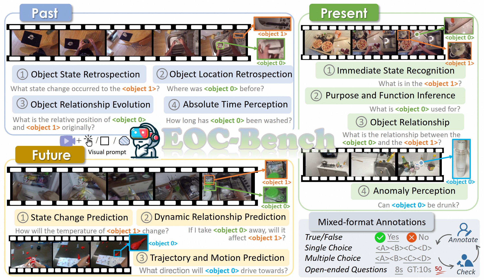
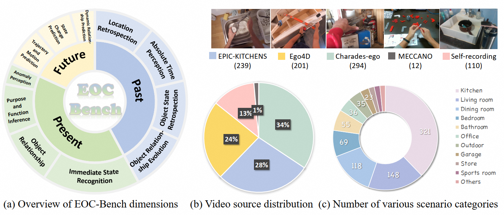

# EOC-Bench : Can MLLMs Identify, Recall, and Forecast Objects in an Egocentric World?

<div align=center>

[](https://arxiv.org/abs/2506.05287) 
[](https://huggingface.co/datasets/CircleRadon/EOC-Bench)
[](https://circleradon.github.io/EOCBench/)
[](https://circleradon.github.io/EOCBench/#leaderboard)
[](https://zhuanlan.zhihu.com/p/1917725466296562079)


</div>

## 🔍 Overview
we introduce <strong>EOC-Bench</strong>, an innovative benchmark designed to systematically evaluate object-centric embodied cognition in dynamic egocentric scenarios.
Specially, <strong>EOC-Bench</strong> features 3,277 meticulously annotated QA pairs categorized into three temporal categories: Past, Present, and Future, covering 11 fine-grained evaluation  dimensions and 3 visual object referencing types.
To ensure thorough assessment, we develop a  mixed-format human-in-the-loop annotation framework with four types of questions and design a novel multi-scale temporal accuracy metric for open-ended temporal evaluation. 

<p align="center">
    
<p>

## 📚 Tasks Definition
EOC-Bench structures questions into three temporally grounded categories: **Past, Present, and Future**, with a total of **11** categories.

<p align="center">
    
<p>

## 🌟 Run Your Own Evaluation
### 🤗 Benchmark
Our benchmark is hosted on [HuggingFace](https://huggingface.co/datasets/CircleRadon/EOC-Bench). 

For all videos, we add the frame with box prompt at the end of the original video.

### 🛠️ Installation
Set up your environment with ease:

```shell
conda create --name eocbench python=3.10
conda activate eocbench

git clone git@github.com:alibaba-damo-academy/EOCBench.git
cd EOCBench

pip install -r requirements.txt
```

### 📈 Evaluation
Our codebase supports a variety of models for evaluation, including `gpt-4o`, `gemini`, `qwen2.5-vl`, `internvl2_5`, `llava_video`, `llava_onevision`, `video_llava`, `longva`, `videollama2`, `videollama3`, `nvila`, `videorefer`, `vip-llava`, `osprey`, and `sphinx-v`. Adjust the model settings in eval.sh, then run the script to begin your evaluation.

To test your own models, you can add a class in the `models` directory with the `generate_outputs` function.

For further instructions and detailed guidance, please refer to our [evaluation documentation](./eval.md).


## 🏆 Leaderboard

The [Leaderboard](https://circleradon.github.io/EOCBench/#leaderboard) for EOC-Bench is continuously being updated, welcoming the contribution of your LVLMs!

To submit your results to the leaderboard, please send to [circleradon@gmail.com]() with your result json files.


## 📑 Citation
```
@article{yuan2025eocbench,
      author    = {Yuqian Yuan, Ronghao Dang, Long Li, Wentong Li, Dian Jiao, Xin Li, Deli Zhao, Fan Wang, Wenqiao Zhang, Jun Xiao, Yueting Zhuang},
      title     = {EOC-Bench: Can MLLMs Identify, Recall, and Forecast Objects in an Egocentric World?},
      journal   = {arXiv},
      year      = {2025},
      url       = {https://arxiv.org/abs/2506.05287}
    }
```

